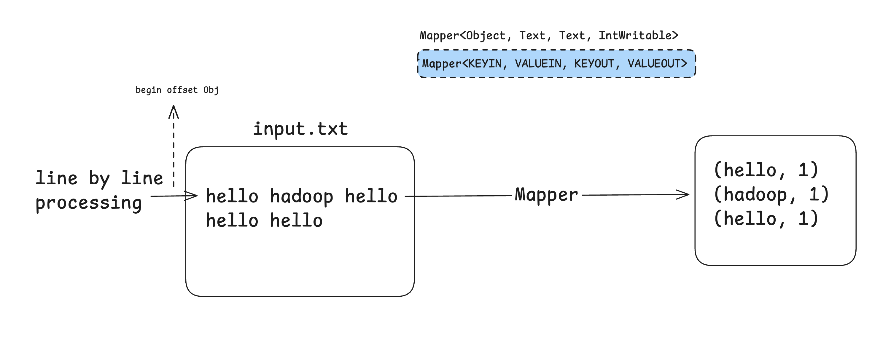

# Hadoop Word Count

## Dependencies

```xml
<dependencies>
        <!-- Hadoop Common -->
        <dependency>
            <groupId>org.apache.hadoop</groupId>
            <artifactId>hadoop-common</artifactId>
            <version>3.3.5</version> <!-- choose version according to your Hadoop setup -->
        </dependency>

        <!-- Hadoop MapReduce Client Core -->
        <dependency>
            <groupId>org.apache.hadoop</groupId>
            <artifactId>hadoop-mapreduce-client-core</artifactId>
            <version>3.3.5</version>
        </dependency>

        <!-- Hadoop MapReduce Client Common -->
        <dependency>
            <groupId>org.apache.hadoop</groupId>
            <artifactId>hadoop-mapreduce-client-common</artifactId>
            <version>3.3.5</version>
        </dependency>

        <!-- Hadoop MapReduce Client JobClient -->
        <dependency>
            <groupId>org.apache.hadoop</groupId>
            <artifactId>hadoop-mapreduce-client-jobclient</artifactId>
            <version>3.3.5</version>
        </dependency>

        <!-- Hadoop HDFS Client (for accessing HDFS) -->
        <dependency>
            <groupId>org.apache.hadoop</groupId>
            <artifactId>hadoop-hdfs</artifactId>
            <version>3.3.5</version>
        </dependency>
    </dependencies>
```

## Flow of Tasks

```java
    //TODO 1 : Create Mapper Class
    //TODO 1.1 : Create map() function
    //TODO 1.2 : Tokenize value using StringTokenizer
    //TODO 1.3 : Iterate over each word and write in context

    //TODO 2 : Create Reducer Class
    //TODO 2.1 : Create reduce method
    //TODO 2.2 : Set sum varaible and add each value to it
    //TODO 2.3 : Set it to result
    //TODO 2.4 : Write it to Context

    //TODO 3 : Create Driver
    //TODO 3.1 : Configuration Setup
    //TODO 3.2 : Command Line Input using GenericOptionsParser
    //TODO 3.3 : Create Job
    //TODO 3.4 : Set Mapper, Reducer, Combiner classes
    //TODO 3.5 : Command Line Input using GenericOptionsParser
    //TODO 3.6 : Set File Paths
```

## Mapper Phase




